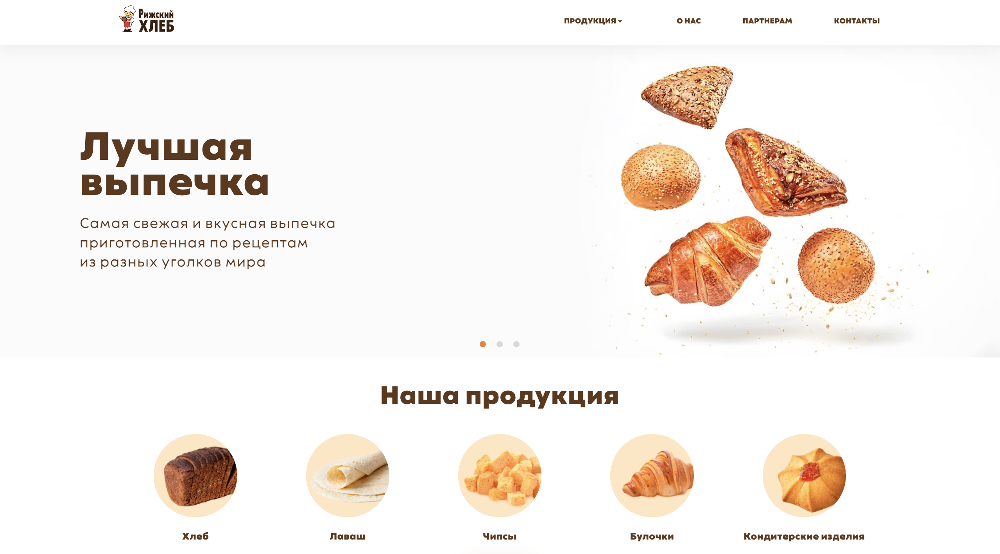
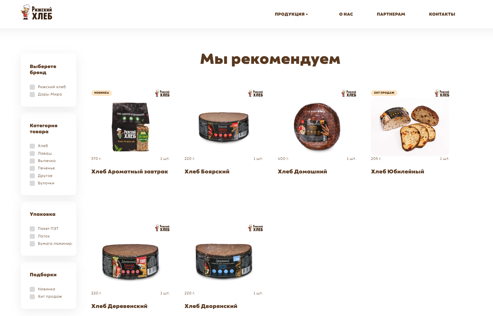
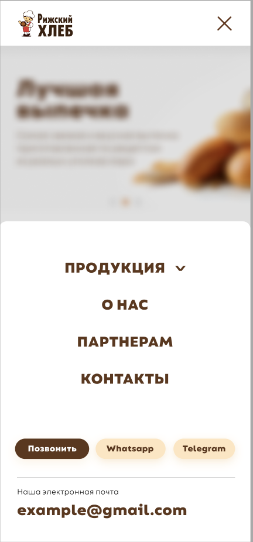

# Информационный сайт  ["Рижский хлеб"](https://oneeuro.github.io/RigaBread/)





Этот проект представляет собой информационный веб-сайт для компании "Рижский хлеб". Сайт предоставляет пользователям информацию о продукции, услугах, истории компании и контактных данных.

### Используемые технологии:

- **HTML**

- **CSS**

- **JavaScript** 

- **WordPress**


## Скриншоты

<div style="display:flex; justify-content: space-between; align-items: flex-start">




</div>

## Инструкции по развёртыванию

1. **Клонируйте репозиторий:**
   ```bash
   git clone https://github.com/OneEuro/RigaBread.git


